# MyCampus 🎓
> A smart campus companion mobile application built with Flutter & Clean Architecture.

Developed as a **Flutter Developer Recruitment Challenge** submission for **SoftTaqwa**.

---

## 📌 Overview

**MyCampus** is a modern student companion mobile application designed to streamline academic life. It provides students with a single intuitive dashboard to manage their daily classes, track attendance, monitor assignments, stay updated with campus notices, engage in campus messaging, and manage their academic profile.

The application is engineered with an emphasis on **Clean Architecture**, strong separation of concerns, robust state management via **BLoC/Cubit**, and explicit dependency injection.

---

## ✨ Features

- 🏠 **Home Dashboard:** Interactive grid offering quick access to core campus tools and high-level activity summaries.
- 📢 **Campus Notices:** Clean list view of announcement cards with detailed views for campus-wide notices and updates.
- 🎪 **Campus Events:** List of upcoming campus events with detailed views and RSVP capabilities.
- 📅 **Classes & Timetable:** Weekly schedule overview with dynamic day-by-day filtering for seamless lecture management.
- 📊 **Attendance Tracker:** Visual progress tracking featuring interactive circular indicators and subject-by-subject attendance breakdowns.
- 🏆 **Academic Results:** Grade summary and GPA performance breakdown.
- 📝 **Assignments Manager:** Task tracker supporting status filtering (All, Pending, Submitted, Completed) and status toggles.
- 💬 **Messages & Chat:** Conversation list view and interactive 1-on-1 chat interface for campus communication.
- 👤 **Student Profile:** Overview of student information, academic credentials, and personalized app settings.

---

## 🖼️ Screenshots

> *Screen previews and UI demonstrations from the MyCampus mobile application*

| Home Dashboard | Weekly Timetable | Attendance Tracker | Academic Results |
| :---: | :---: | :---: | :---: |
| 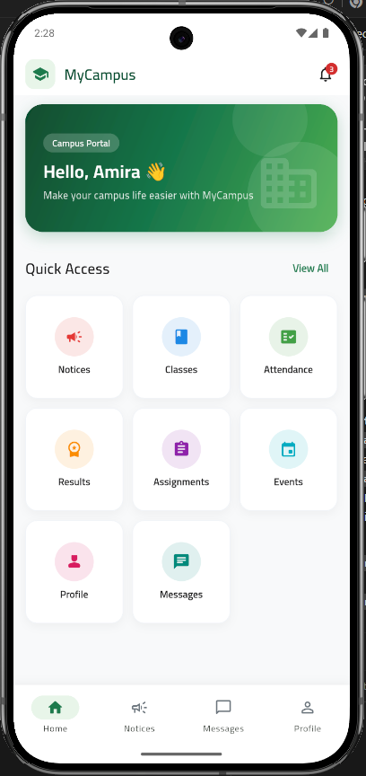 | 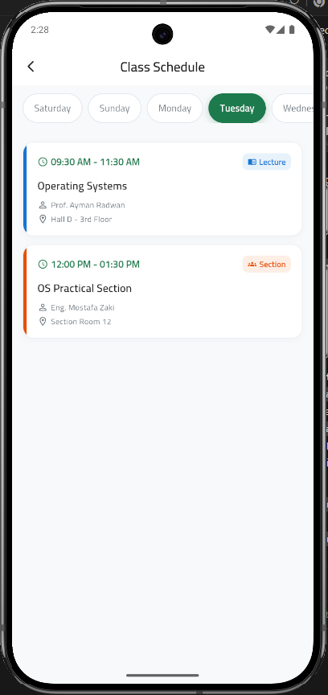 | 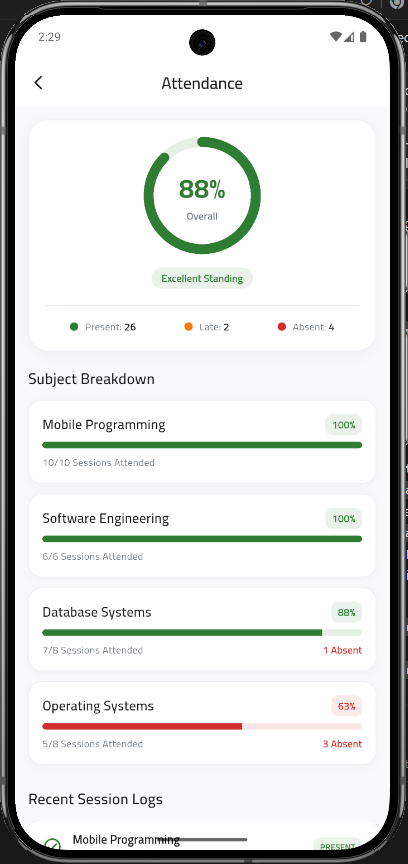 | 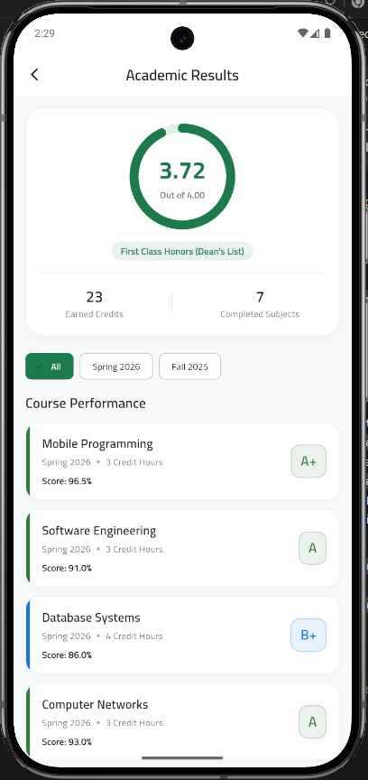 |

| Campus Notices | Notice Details | Campus Events | Event Details |
| :---: | :---: | :---: | :---: |
| 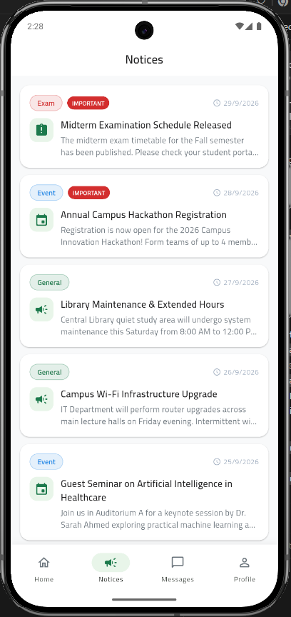 | 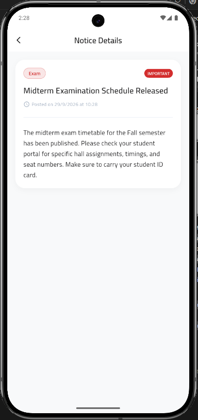 | 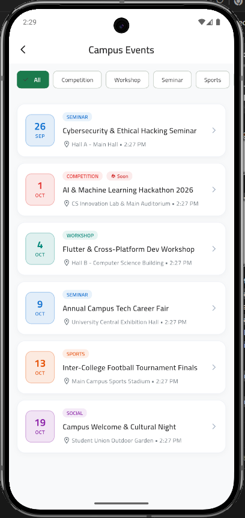 | 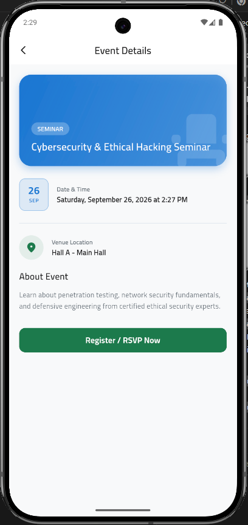 |

| Assignments Manager | Messages & Chat | Chat Details | Student Profile |
| :---: | :---: | :---: | :---: |
| 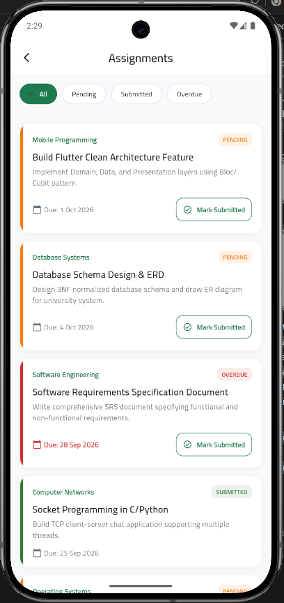 | 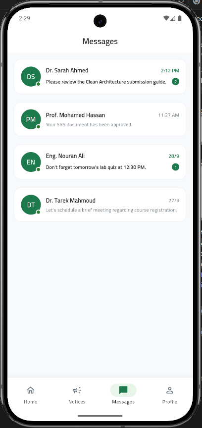 | 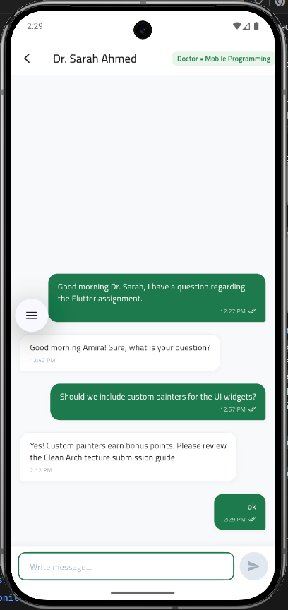 | 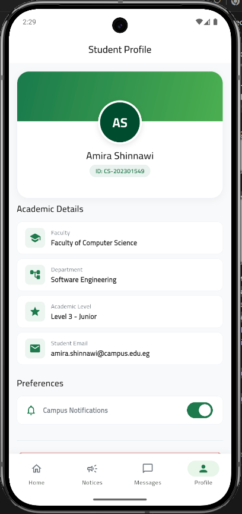 |

---

## 🏗️ Architecture & Project Structure

MyCampus adheres strictly to **Clean Architecture** principles, partitioning code into clear functional layers to maximize testability, maintainability, and independence from external frameworks or APIs.

### Architectural Layers per Feature

1. **Data Layer (`data/`):**
   - **Models:** Data Transfer Objects (DTOs) with serialization logic.
   - **Data Sources:** Local mock implementations returning sample domain data.
   - **Repositories:** Implements domain repository interfaces, converting raw data into domain entities.

2. **Domain Layer (`domain/`):**
   - **Entities:** Core business objects.
   - **Repositories:** Abstract interface contracts defining data operations.
   - **Use Cases:** Encapsulated business logic units governing specific app interactions.

3. **Presentation Layer (`presentation/`):**
   - **BLoC / Cubit:** State management logic handling events and emitting immutable UI states.
   - **Views / Widgets:** Modular UI elements built with Flutter Material 3 components.

### 📂 Directory Structure

```text
lib/
├── core/                        # Shared infrastructure & utilities
│   ├── constants/               # Color palettes, asset paths, text styles
│   ├── di/                      # Dependency Injection setup (get_it)
│   ├── errors/                  # Custom failures & exception handlers
│   ├── router/                  # App navigation configuration (go_router)
│   ├── theme/                   # Material 3 theme configurations
│   ├── usecase/                 # Base UseCase abstractions
│   └── widgets/                 # Reusable UI components across features
│
└── features/                    # Feature-first modular organization
    ├── home/                    # Dashboard grid feature
    ├── notices/                 # Campus notices & announcements
    ├── classes/                 # Class schedule & timetable
    ├── attendance/              # Attendance breakdown & metrics
    ├── assignments/             # Task listing & status updates
    ├── messages/                # Conversations list & 1-on-1 chat
    ├── profile/                 # Student profile & settings
    └── ...                      # [{data}, {domain}, {presentation}] per feature
```

---

## 🛠️ Tech Stack & Dependencies

- **Framework:** [Flutter](https://flutter.dev/) (Dart SDK)
- **State Management:** [`flutter_bloc`](https://pub.dev/packages/flutter_bloc) / Cubit
- **Dependency Injection:** [`get_it`](https://pub.dev/packages/get_it)
- **Navigation & Routing:** [`go_router`](https://pub.dev/packages/go_router)
- **Architecture:** Clean Architecture + Repository Pattern
- **UI Design System:** Material 3 with custom widgets & responsive layouts

---

## 🧠 Design Decisions & Engineering Trade-offs

### 1. Mock Data & Repository Pattern Decoupling
Rather than embedding direct API dependencies or binding early to live backends like Firebase or REST, all data access goes through contract-driven **Repository Interfaces**. 
- **Benefit:** Replacing local mock data sources with production REST APIs or Firebase services in the future requires **zero modifications** to the `Domain` or `Presentation` layers—only new Data Source and Repository implementations need to be provided.

### 2. Focused Feature Scope & Architectural Depth
The project deliberately focuses on core campus features (Home, Notices, Classes, Attendance, Assignments, Messages, Profile) rather than attempting an oversized, monolithic application.
- **Rationale:** Prioritizes structural depth, clean state boundaries, strict layer separation, and solid architecture practices over surface-level quantity.

---

## 🚀 Getting Started

### Prerequisites
- [Flutter SDK](https://docs.flutter.dev/get-started/install) (`>= 3.0.0`)
- Dart SDK (`>= 3.0.0`)
- Android Studio / VS Code with Flutter extensions enabled

### Installation & Setup

1. **Clone the Repository:**
   ```bash
   git clone https://github.com/amira-shinnawi/my_campus_app.git
   cd my_campus_app
   ```

2. **Fetch Dependencies:**
   ```bash
   flutter pub get
   ```

3. **Run the Application:**
   ```bash
   flutter run
   ```

---
*Built for the SoftTaqwa Flutter Developer Recruitment Challenge.*
